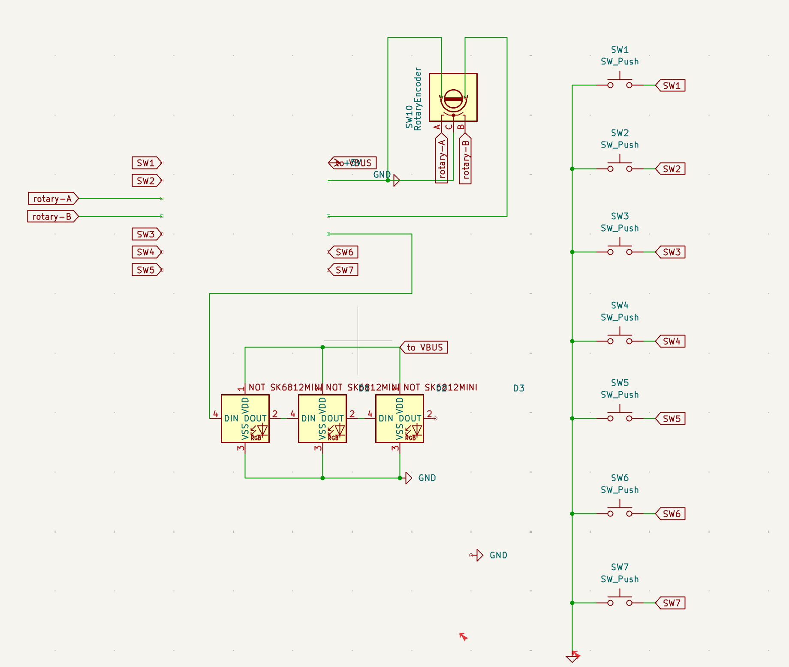
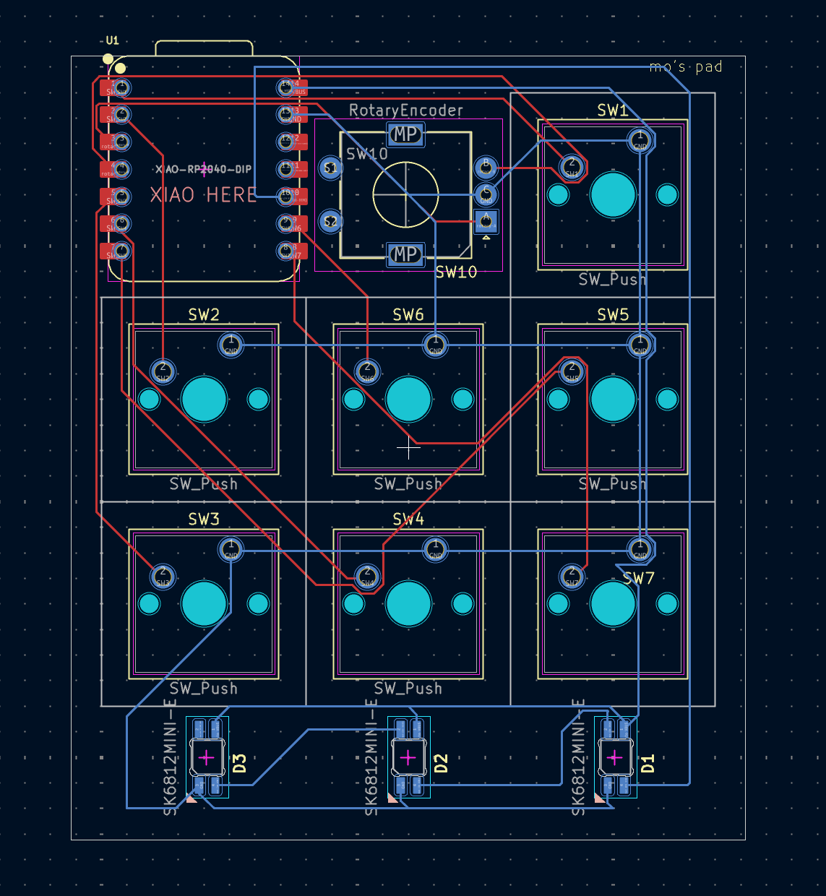
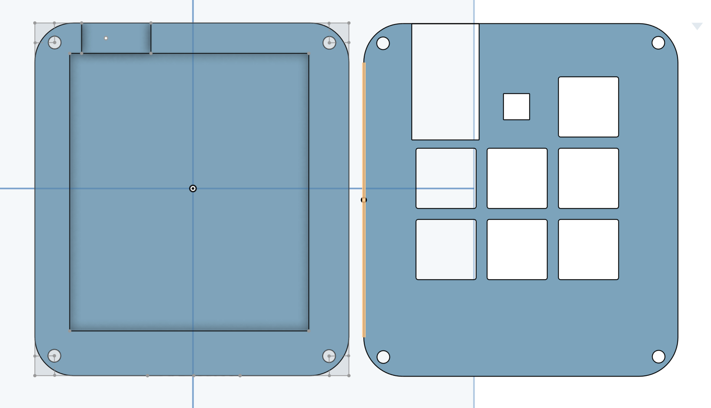

# mo's hackpad
This hackpad is my first electronics project! I love the world of electronics and embedded software engineering, and I really wanted to get my hands dirty making my first project as part of my 2026 goals. Now I can say that in just the first week of 2026, I've made my very first PCB (which I'm super proud of!). This is all thanks to Blueprint via Hackpad :) yayy!

## Features
- 7 Keys, 1 top key for toggling settings (hopefully a feature I will add in the future)
- 1 Rotary Encoder for any usage
- 3 LED's

## PCB
My PCB was made in KiCad, had a few issues routing the LED's.

PCB Schematic 

PCB 

## CAD
The 3D model of my Hackpad case was made in Onshape since I had a few issues installing Fusion360.

Hackpad Case 3D Model 

## Firmware

The firmware is pretty basic, using KMK firmware. I plan to update it in the future as I get better with electronics and embedded software engineering.

## BOM
- 1x XIAO RP2040
- 1x EC11 Rotary Encoder
- 7x Cherry MX Switches
- 1x Case (2 printed parts)
- 3x SKIMINI-E LEDs
